# Documentor — UML Diagrams

> Last updated: March 8, 2026 — reflects all code changes including fine-tuned T5,
> two-column PDF extraction, AISemanticCitationMatcher, two-pass citation matching,
> multi-feature AI detection, side-by-side grammar diff, and grammar training pipeline.

## Table of Contents
1. [Use Case Diagram](#1-use-case-diagram)
2. [Sequence — User Registration](#2-sequence-diagram--user-registration)
3. [Sequence — User Login (Email & Social)](#3-sequence-diagram--user-login)
4. [Sequence — Document Upload & Processing (incl. Two-Column PDF)](#4-sequence-diagram--document-upload--processing)
5. [Sequence — Grammar Enhancement (Side-by-Side Diff)](#5-sequence-diagram--grammar-enhancement)
6. [Sequence — Grammar Model Fine-Tuning](#6-sequence-diagram--grammar-model-fine-tuning)
7. [Sequence — Plagiarism Detection](#7-sequence-diagram--plagiarism-detection)
8. [Sequence — AI Content Detection](#8-sequence-diagram--ai-content-detection)
9. [Sequence — Citation Extraction & AI Matching](#9-sequence-diagram--citation-extraction--ai-matching)
10. [Sequence — Document Formatting (AI Pipeline)](#10-sequence-diagram--document-formatting-ai-pipeline)
11. [Sequence — Section Detection](#11-sequence-diagram--document-section-detection)
12. [Sequence — Subscription & Payment](#12-sequence-diagram--subscription--payment)
13. [Component Architecture Diagram](#13-component-architecture-diagram)
14. [Data Flow — Citation Two-Pass Matching](#14-data-flow--citation-two-pass-matching)

---

## 1. Use Case Diagram

> **Actors**: User (Student/Researcher), Admin, Stripe, OAuth Provider, Python NLP Service

```mermaid
flowchart TB
    classDef actor fill:#dae8fc,stroke:#6c8ebf,color:#000,font-weight:bold
    classDef usecase fill:#d5e8d4,stroke:#82b366,color:#000
    classDef ext fill:#fff2cc,stroke:#d6b656,color:#000,font-weight:bold

    U(["👤 User\nStudent / Researcher"]):::actor
    AD(["🛡️ Admin"]):::actor
    STRIPE(["💳 Stripe"]):::ext
    OAUTH(["🔑 OAuth Provider\nGoogle / Facebook / Apple"]):::ext
    NLP(["🐍 Python NLP Service\nFlask :5001"]):::ext

    subgraph SYSTEM ["Documentor Application"]
        subgraph AUTH_UC ["Authentication"]
            UC_REG("Register Account"):::usecase
            UC_LOGIN("Login with Email"):::usecase
            UC_SOC("Social Login"):::usecase
            UC_RESET("Reset Password"):::usecase
        end

        subgraph DOC_UC ["Document Management"]
            UC_UP("Upload Document\nPDF / DOCX / TXT / LaTeX"):::usecase
            UC_VIEW("View / Edit Document"):::usecase
            UC_DL("Download Document"):::usecase
            UC_DEL("Delete Document"):::usecase
            UC_PROJ("Manage Projects"):::usecase
            UC_DASH("View Dashboard Stats"):::usecase
        end

        subgraph NLP_UC ["NLP Analysis"]
            UC_GRAM("Enhance Grammar\nFine-tuned flan-t5-base"):::usecase
            UC_PLAG("Detect Plagiarism\nTF-IDF + all-MiniLM-L6-v2"):::usecase
            UC_AI("Detect AI Content\nMulti-feature + GPT-2"):::usecase
            UC_CIT("Extract & Match Citations\nRegex + AISemanticCitationMatcher"):::usecase
            UC_SEC("Detect Document Sections\nGaussianNB + Regex"):::usecase
        end

        subgraph FMT_UC ["Formatting & Export"]
            UC_FMT("Apply Citation Style\nAPA/MLA/IEEE/Chicago/Harvard"):::usecase
            UC_AIFMT("AI-Powered Formatting\n4-step pipeline"):::usecase
            UC_EXP("Export PDF / DOCX / LaTeX"):::usecase
        end

        subgraph SUB_UC ["Subscription"]
            UC_PLANS("Browse Pricing Plans"):::usecase
            UC_SUB("Subscribe / Upgrade Plan"):::usecase
            UC_CANCEL("Cancel Subscription"):::usecase
        end

        subgraph ADMIN_UC ["Administration"]
            UC_TPLS("Manage Style Templates"):::usecase
            UC_LOGS("View System Logs"):::usecase
            UC_USERS("Manage Users"):::usecase
        end
    end

    U --> UC_REG
    U --> UC_LOGIN
    U --> UC_SOC
    U --> UC_RESET
    U --> UC_UP
    U --> UC_VIEW
    U --> UC_DL
    U --> UC_DEL
    U --> UC_PROJ
    U --> UC_DASH
    U --> UC_GRAM
    U --> UC_PLAG
    U --> UC_AI
    U --> UC_CIT
    U --> UC_SEC
    U --> UC_FMT
    U --> UC_AIFMT
    U --> UC_EXP
    U --> UC_PLANS
    U --> UC_SUB
    U --> UC_CANCEL

    AD --> UC_TPLS
    AD --> UC_LOGS
    AD --> UC_USERS

    UC_SOC -->|"uses"| OAUTH
    UC_SUB -->|"initiates payment"| STRIPE
    UC_CANCEL -->|"cancels via"| STRIPE

    UC_GRAM -->|"calls"| NLP
    UC_PLAG -->|"calls"| NLP
    UC_AI -->|"calls"| NLP
    UC_CIT -->|"calls"| NLP
    UC_SEC -->|"calls"| NLP
    UC_AIFMT -->|"calls"| NLP
```

---

## 2. Sequence Diagram — User Registration

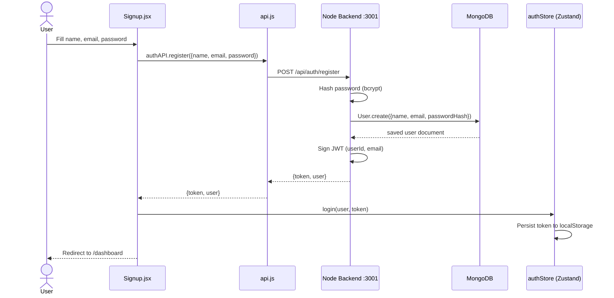

---

## 3. Sequence Diagram — User Login

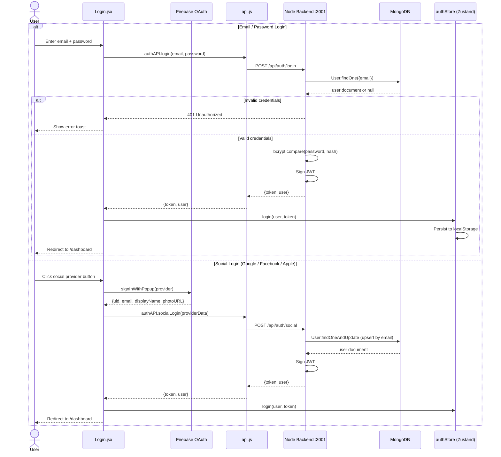

---

## 4. Sequence Diagram — Document Upload & Processing

> Includes **two-column IEEE PDF** detection via `_find_column_gutter()` / `_split_by_column()`

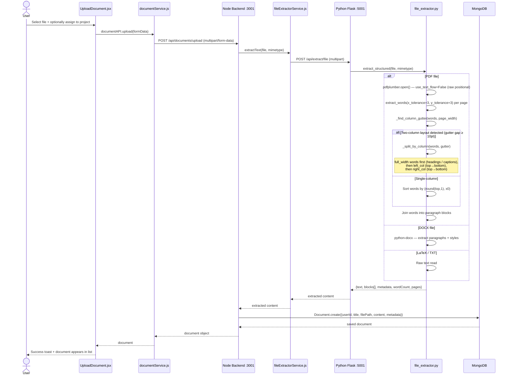

---

## 5. Sequence Diagram — Grammar Enhancement

> Results tab shows **side-by-side diff**: left = original, right = highlighted enhanced text

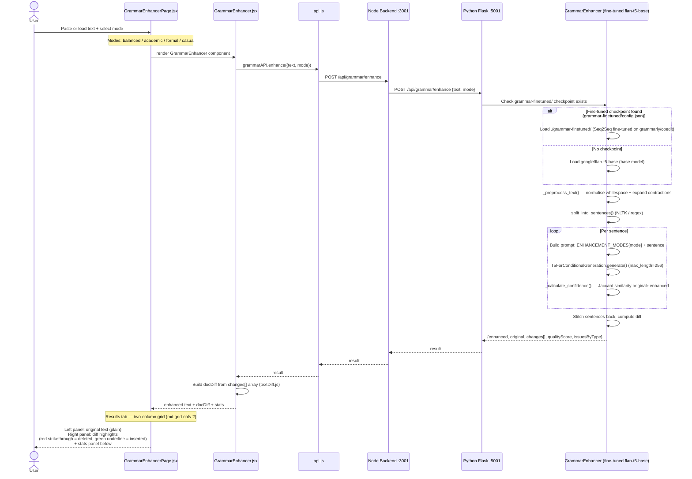

---

## 6. Sequence Diagram — Grammar Model Fine-Tuning

> `train_grammar.py` — fine-tunes `google/flan-t5-base` on `grammarly/coedit`

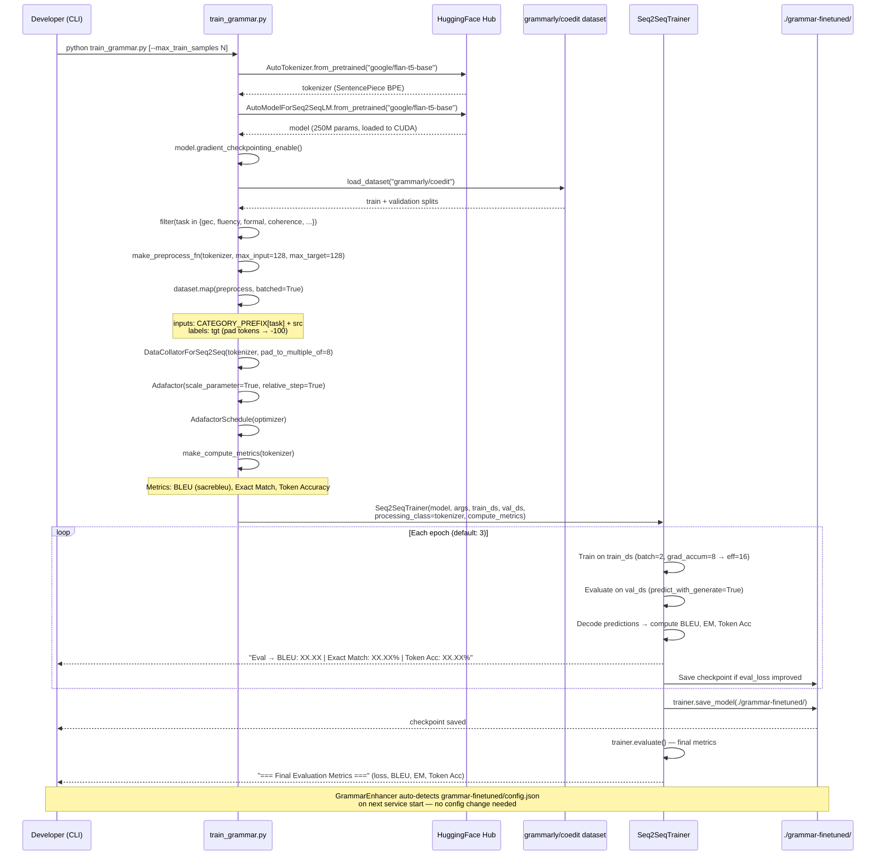

---

## 7. Sequence Diagram — Plagiarism Detection

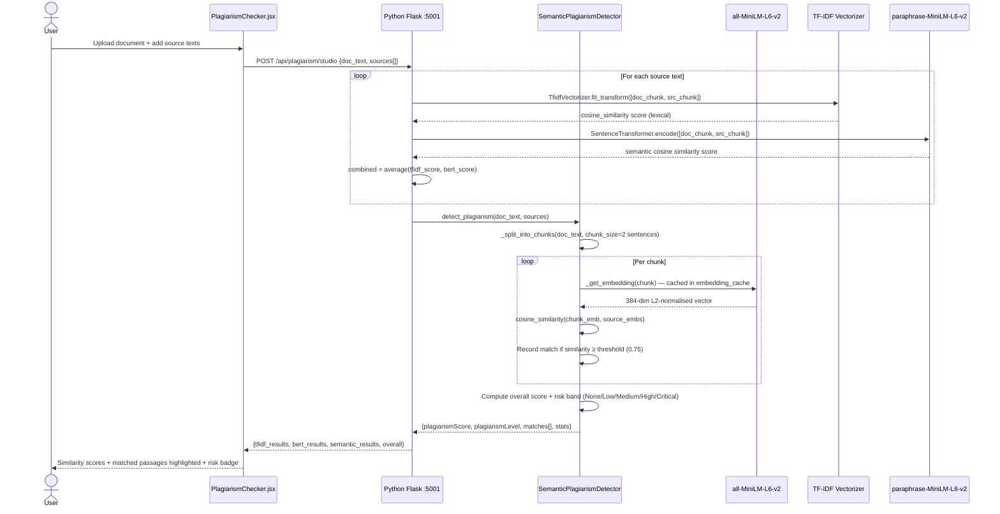

---

## 8. Sequence Diagram — AI Content Detection

> Multi-feature heuristic scorer. GPT-2 perplexity is **supplementary only** (±5 pts max).

```mermaid
sequenceDiagram
    actor User
    participant AD as PlagiarismChecker.jsx (AI tab)
    participant PY as Python Flask :5001
    participant SA as studio_ai_detect()
    participant GPT2 as GPT-2 LMHeadModel (lazy-loaded)

    User->>AD: Paste text to analyse
    AD->>PY: POST /api/ai-detect {text}

    PY->>SA: studio_ai_detect(text)

    SA->>SA: Guard: len(text) < 80 → return "Too short to analyze"

    SA->>SA: Feature 1 — Sentence burstiness (weight: ±35 pts)
    Note over SA: Split on [.!?], filter sentences ≥ 4 words<br/>burstiness = (σ - μ) / (σ + μ)<br/>low/negative → AI-uniform; high positive → human-varied

    SA->>SA: Feature 2 — Coefficient of Variation (weight: ±20 pts)
    Note over SA: CV = σ / μ of sentence lengths<br/>CV < 0.25 → strongly AI; CV > 0.70 → human

    SA->>SA: Feature 3 — Mean sentence length (weight: ±10 pts)
    Note over SA: ChatGPT sweet spot: 14–26 words

    SA->>SA: Feature 4 — Filler phrase density (weight: +15 pts)
    Note over SA: 28 ChatGPT signature phrases counted<br/>("delve into", "it is important to note", "furthermore", etc.)

    SA->>SA: Feature 5 — Type-Token Ratio (vocabulary diversity)
    Note over SA: TTR = unique_words / total_words (context only)

    SA->>GPT2: _gpt2_perplexity(text) — supplementary ±5 pts
    Note over GPT2: GPT2LMHeadModel.from_pretrained("gpt2") lazy-loaded<br/>cross-entropy over token sequence → perplexity<br/>NOTE: ChatGPT text has GPT-2 perplexity ~100–300 (NOT low)
    GPT2-->>SA: perplexity score (or None if unavailable)

    SA->>SA: Score = 50 + Σ weighted feature contributions
    SA->>SA: Clamp score to [0, 100]
    SA->>SA: Map to label:
    Note over SA: ≥75 → Likely AI-generated<br/>≥55 → Possibly AI-generated<br/>≥40 → Uncertain<br/>≥25 → Probably human-written<br/><25 → Likely human-written

    SA-->>PY: {score, label, perplexity, features{burstiness, sentence_cv,<br/>mean_sentence_len, filler_density, ttr}}
    PY-->>AD: result
    AD-->>User: Score gauge + label badge + per-feature breakdown card
```

---

## 9. Sequence Diagram — Citation Extraction & AI Matching

> Two-pass matching: **Pass 1** = regex/IEEE numeric; **Pass 2** = `AISemanticCitationMatcher` fallback.
> New endpoint: `POST /api/citations/match-ai`

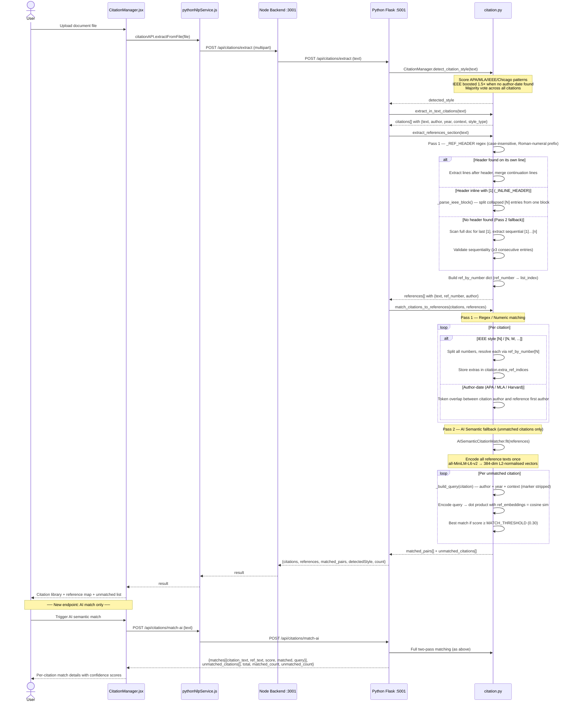

---

## 10. Sequence Diagram — Document Formatting (AI Pipeline)

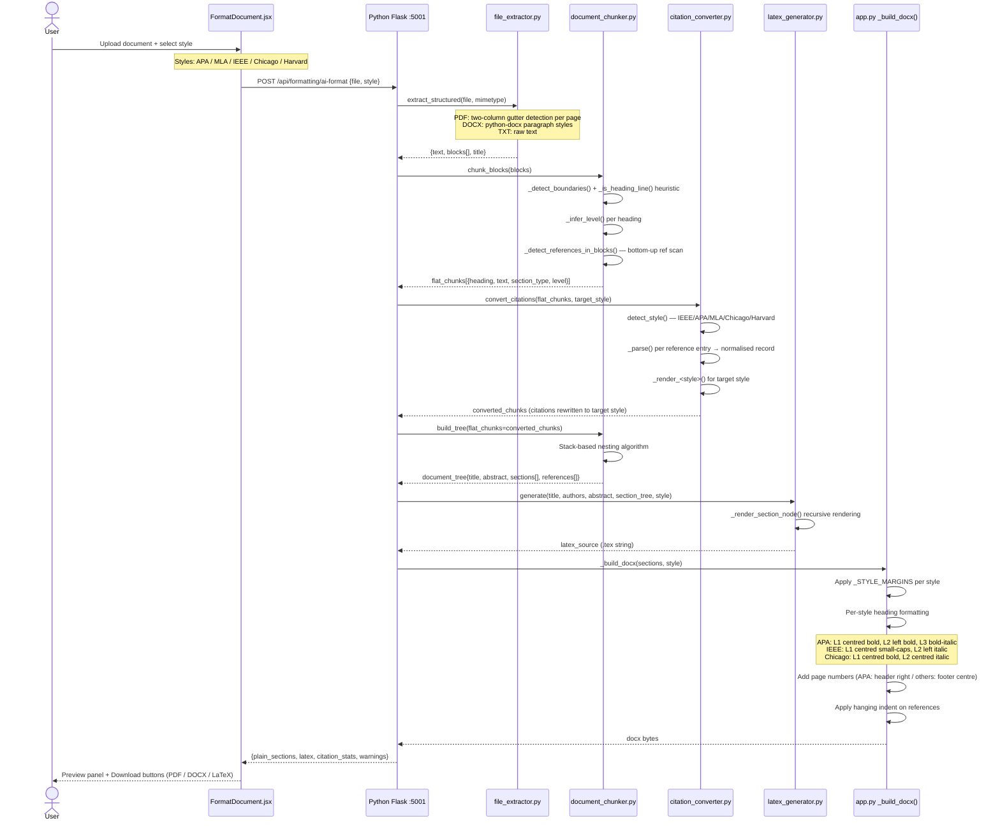

---

## 11. Sequence Diagram — Document Section Detection

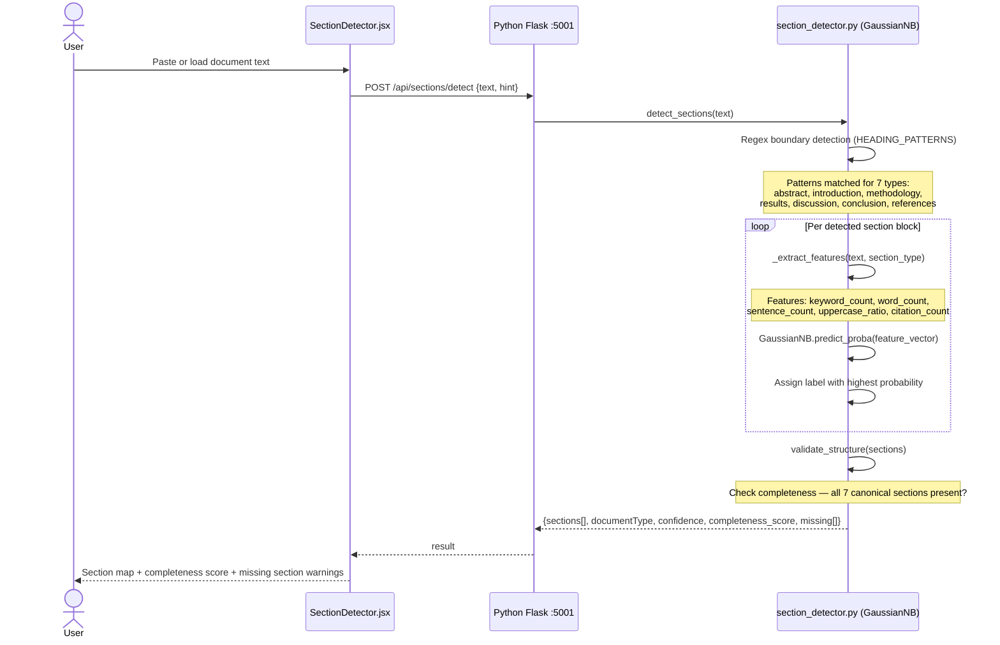

---

## 12. Sequence Diagram — Subscription & Payment

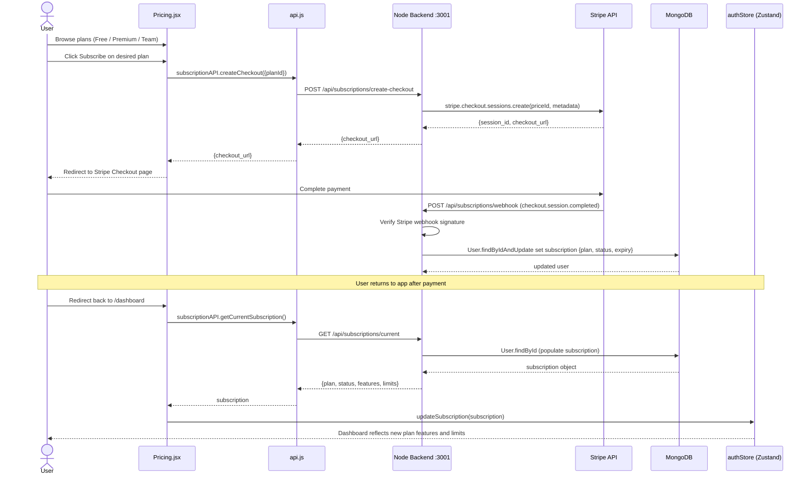

---

## 13. Component Architecture Diagram

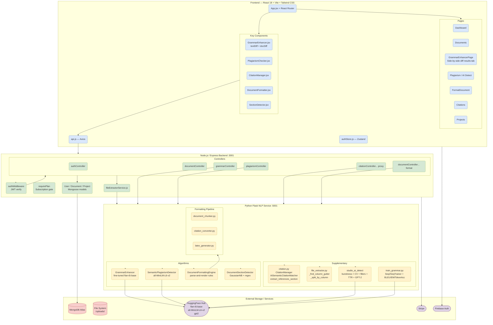

---

## 14. Data Flow — Citation Two-Pass Matching

```mermaid
flowchart TD
    classDef input fill:#dae8fc,stroke:#6c8ebf
    classDef proc fill:#d5e8d4,stroke:#82b366
    classDef decision fill:#fff2cc,stroke:#d6b656
    classDef output fill:#f8cecc,stroke:#b85450
    classDef ai fill:#e1d5e7,stroke:#9673a6

    IN_TEXT([Input: Raw Document Text]):::input

    STYLE[detect_citation_style\nMajority vote — IEEE/APA/MLA/Chicago/Harvard]:::proc
    EXTRACT_CIT[extract_in_text_citations\nRegex patterns per style]:::proc
    REF_EXTRACT[extract_references_section]:::proc

    subgraph REF_PARSE ["Reference Extraction (3 strategies)"]
        R1{_REF_HEADER found\non own line?}:::decision
        R2{Header inline\nwith bracket 1\n_INLINE_HEADER?}:::decision
        R3[_parse_ieee_block\nSplit collapsed entries on bracket N]:::proc
        R4[Full-doc fallback\nFind last bracket 1\nExtract sequential block]:::proc
        R5[Normal line-by-line extraction\nMerge continuation lines]:::proc
        REFNUM[Build ref_by_number dict\nref_number → list_index]:::proc
    end

    PASS1{Pass 1 — Regex/Numeric}:::decision

    subgraph P1 ["Pass 1: IEEE / Author-Date"]
        IEEE_MATCH[IEEE bracket N\nResolve ALL numbers\nExtras → extra_ref_indices]:::proc
        APA_MATCH[Author-date\nToken overlap match]:::proc
    end

    MATCHED1{All citations\nmatched?}:::decision

    subgraph P2 ["Pass 2: AI Semantic Fallback"]
        FIT[AISemanticCitationMatcher.fit\nEncode all refs once\nall-MiniLM-L6-v2 384-dim]:::ai
        QUERY[_build_query\nauthor + year + context sentence\n(marker stripped)]:::ai
        ENCODE[Encode query\ndot product = cosine sim]:::ai
        THRESH{score ≥ 0.30?}:::decision
        MATCHED_AI([Matched with confidence score]):::output
        UNMATCHED([Surfaced as unmatched]):::output
    end

    RESULT([Final result\nmatched_pairs + unmatched_citations\ntotal / matched / unmatched counts]):::output

    IN_TEXT --> STYLE --> EXTRACT_CIT
    IN_TEXT --> REF_EXTRACT --> R1
    R1 -->|Yes| R5 --> REFNUM
    R1 -->|No| R2
    R2 -->|Yes| R3 --> REFNUM
    R2 -->|No| R4 --> REFNUM

    EXTRACT_CIT --> PASS1
    REFNUM --> PASS1
    PASS1 -->|IEEE| IEEE_MATCH
    PASS1 -->|Author-date| APA_MATCH
    IEEE_MATCH --> MATCHED1
    APA_MATCH --> MATCHED1
    MATCHED1 -->|Yes — all matched| RESULT
    MATCHED1 -->|No — unmatched remain| FIT
    FIT --> QUERY --> ENCODE --> THRESH
    THRESH -->|Yes| MATCHED_AI --> RESULT
    THRESH -->|No| UNMATCHED --> RESULT
```
